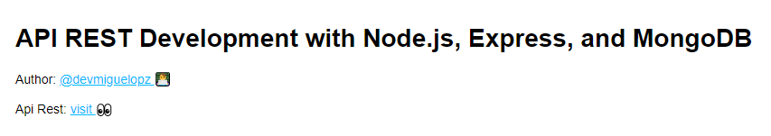

## 🏗 Construido con
- Node
- Express
- MongoDb

## 💻 Instalación
Ejecutar la instalación de dependencías:
```bash
npm install
```

Ejecutar el proyecto en modo de desarrolo (Pruebas en entorno local):
```bash
npm run development
```

Ejecutar el proyecto en modo de desarrolo debugger:
```bash
npm run debugger
```

Ejecutar pruebas unitarias en modo de desarrollo (Pruebas en entorno local):
```bash
npm run testDev
```

Ejecutar pruebas unitarias en modo de producción(fb):
```bash
npm run testPro
```

## 📐 Arquitectura
Arquitectura del API, la cual está basada en una estructura MVC, donde MC lo maneja el proyecto API REST.

  - server.js => Encargado de le implementar la estructura del API REST.
  - Api/config => Maneja la información estática para el proyecto.
  - Api/controllers => Encargado de manejar las transacciones con el modelo(base de datos).
  - Api/database => Encargado de manejar la conexión con la base de datos.
  - Api/dtos => Objeto de datos de transferencia, encargado de gestionar el modelo que será enviado al cliente.
  - Api/models => Encargado de manejar la representación de la base de datos.
  - Api/environments => Encargado de manejar datos del proceso del servidor e independizar los entornos.
  - Api/routes => Encargado de manejar rutas de servicios.
  - Api/utils => Encargado de manejar validaciones y cosas que no dependan de la arquitectura del proyecto.
  - Test => Encargado de manejar pruebas unitarias y de estrés.

## 🗄 Deploy
Servicio implementado en la plataforma Heroku, añadiendo implementación contínua (CI/CD) con la plataformas  de GitHub y Travis.

  - 1. Creación del proyecto en la plataforma de GitHub.
  - 2. Configuración del archivo .travis.yml (Este archivo permite la implementación contínua (CI/CD) con GitHub).
  - 3. Creación del proyecto en la platafora Heroku.
  - 4. Vincular el proyecto de la plataforma Heroku con GitHub.
  - 5. Subir cambios al respositório de GitHub.
  - 6. Visualizar cambios en el servicio principal de Heroku.

## 📄 Proyecto
- API REST Web: [API REST](https://api-rest-evaluation-alm.herokuapp.com/)

## 👤 Author
**Miguel López**

- GitHub: [@devmiguelopz](https://gitHub.com/devmiguelopz)
- Linkedin: [Miguel López](https://www.linkedin.com/in/miguel-lopez-monzon/)

## 🤝 Contribuciones
¡Las contribuciones, los problemas y las solicitudes de características son bienvenidos!

No dudes en chequear [issues page](https://gitHub.com/devmiguelopz/App_Api_Rest_Evaluation_ALM/issues/).

## Muestra tu apoyo
¡Dale una ⭐️ si te gusta este proyecto!

## 📝 Licencia
MIT.
